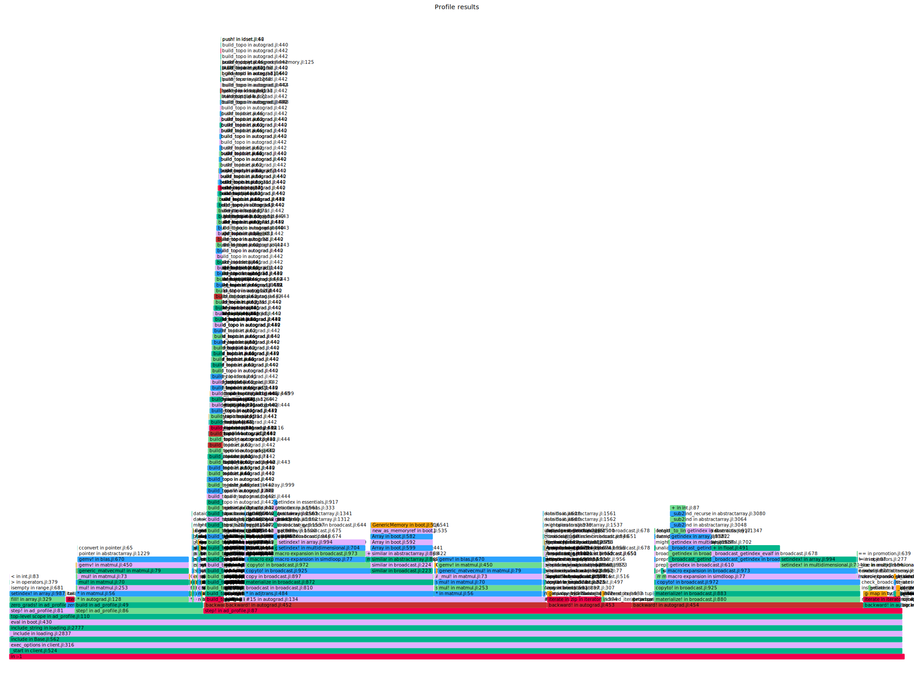
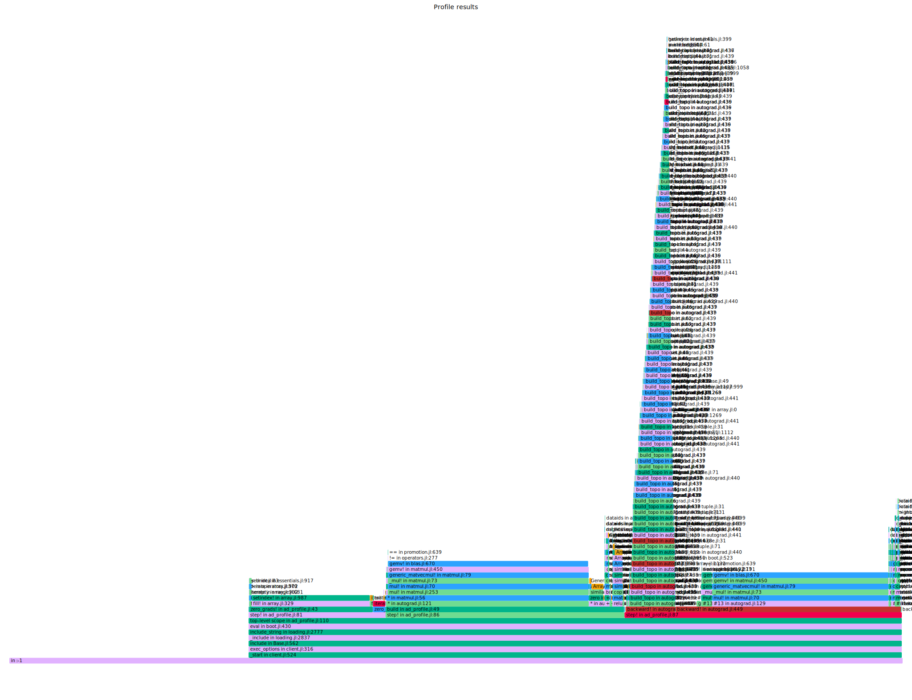
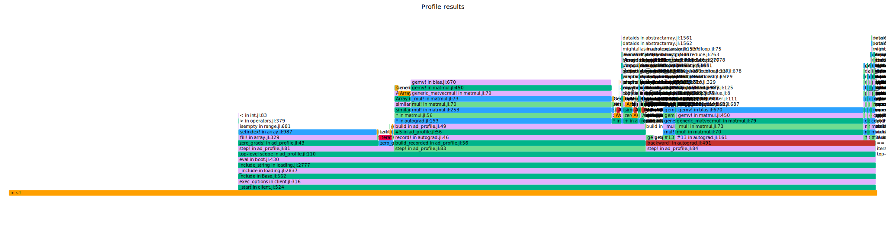

# Autograd Benchmark — Plain -> `mul!` -> Tape

Three commits of `src/autograd.jl`, each benchmarked with the same workload via
[`profiling/ad_benchmark.jl`](../ad_benchmark.jl).

| Stage   | Commit    | Description                          |
|---------|-----------|--------------------------------------|
| Plain   | `50cfaa2` | Add the model and some fixes on the autograd |
| `mul!`  | `bb10e98` | Refactor the autograd (in-place matmul grads) |
| Tape    | `ea5e92e` | Added the tape (flat replay of the backward pass) |

**Workload:** a stack of `LAYERS=32` blocks of `relu(W*x + b)` at `DIM=128`,
giving **162 graph nodes**. Forward and backward are timed separately so each
change can be attributed to the pass it touches. Times are the **minimum**
sample (least-noisy estimate); allocations and memory are per backward (or
forward) invocation.

How to reproduce:

```
julia --project=@bench profiling/ad_benchmark.jl <path/to/autograd.jl> <label>
```

---

## Results

### Plain (`50cfaa2`)

| pass                        | min (µs) | median (µs) | mean (µs) | allocs | memory     |
|-----------------------------|---------:|------------:|----------:|-------:|-----------:|
| forward                     |   100.56 |      104.85 |    124.41 |    550 | 220.7 KiB  |
| backward (recursive)        |  1418.48 |     1680.52 |   1875.83 |   2539 | 4.18 MiB   |
| total (fwd + bwd recursive) |  1519.04 |     1785.36 |   2000.24 |   3089 | 4.40 MiB   |

### `mul!` (`bb10e98`)

| pass                        | min (µs) | median (µs) | mean (µs) | allocs | memory     |
|-----------------------------|---------:|------------:|----------:|-------:|-----------:|
| forward                     |   106.53 |      121.86 |    157.33 |    582 | 223.2 KiB  |
| backward (recursive)        |   470.62 |      553.76 |    596.54 |    348 | 24.5 KiB   |
| total (fwd + bwd recursive) |   577.15 |      675.62 |    753.86 |    930 | 247.8 KiB  |

### Tape (`ea5e92e`)

| pass                        | min (µs) | median (µs) | mean (µs) | allocs | memory     |
|-----------------------------|---------:|------------:|----------:|-------:|-----------:|
| forward                     |   112.56 |      120.06 |    146.68 |    783 | 234.4 KiB  |
| backward (recursive)        |   469.63 |      542.45 |    588.02 |    348 | 24.5 KiB   |
| backward (tape)             |   394.63 |      455.22 |    491.00 |  **0** | **0 B**    |
| total (fwd + bwd recursive) |   582.20 |      662.51 |    734.69 |   1131 | 258.9 KiB  |
| total (fwd + bwd tape)      |   507.20 |      575.28 |    637.68 |    783 | 234.4 KiB  |

---

## The gain at each commit

### Plain -> `mul!`: kill the backward-pass allocations

The original backward pass allocated a fresh array for every gradient
contribution (notably the matmul gradients `dW`, `dx`). Switching those to
in-place `mul!`/accumulation is the single biggest win in the whole series:

| metric (backward)   | Plain     | `mul!`   | gain          |
|---------------------|----------:|---------:|---------------|
| time (min)          | 1418.48 µs| 470.62 µs| **3.01× faster** |
| allocations         | 2539      | 348      | **7.3× fewer**  |
| memory              | 4.18 MiB  | 24.5 KiB | **≈175× less**  |

End-to-end (forward + backward) drops from **1519 µs -> 577 µs (2.63×)** and
total memory from **4.40 MiB -> 247.8 KiB**. The forward pass is essentially
unchanged, this commit is purely a backward-pass fix. The 4.18 MiB of
short-lived garbage per backward call is what dominated the Plain flame graph.

**Plain**:`backward!` is wide and topped by allocation/GC frames from the
per-op gradient arrays:



**`mul!`**: allocation stacks under `backward!` collapse; what remains is
the matmul kernels (`gemm!`/`mul!`) and the `build_topo` traversal that the
recursive `backward!` still has to run on every call:



### `mul!` -> Tape: an allocation-free backward replay

With allocations already gone, the remaining cost is graph traversal: the
recursive `backward!` walks parents and re-discovers the topological order on
every call. The tape records that order once during the forward pass and
replays it as a flat loop:

| metric (backward)   | `mul!` (recursive) | Tape (replay) | gain          |
|---------------------|-------------------:|--------------:|---------------|
| time (min)          | 470.62 µs          | 394.63 µs     | **1.19× faster** |
| allocations         | 348                | **0**         | fully eliminated |
| memory              | 24.5 KiB           | **0 B**       | fully eliminated |

The backward pass is now **completely allocation-free**: every gradient
buffer it touches already exists, and the traversal itself allocates nothing.
The cost moves into the forward pass instead (recording the tape: 582 -> 783
allocs, 223 -> 234 KiB), which is paid once and reused.

End-to-end the tape path totals **507 µs vs `mul!`'s 577 µs (1.14× faster)**,
with the recursive path still available as a fallback (and now matching `mul!`
since the underlying autograd is the same).

This is visible directly in the profiles. In the **`mul!`** graph above,
`backward!` still spends a lot of its width in **`build_topo`**,
re-computing the topological order of the graph on every backward call.
In the **Tape** graph, that frame is gone entirel: ordering happens once in
`build_recorded` during the forward pass, and the backward replay is a flat loop
over the tape with no traversal and no allocation:



Note how `build_topo` no longer appears under `backward!`, it has been
replaced by `build_recorded` on the forward pass, and the backward part is
now just the arithmetic operations.

### Cumulative: Plain -> Tape

| metric (total, best path) | Plain     | Tape       | overall gain   |
|---------------------------|----------:|-----------:|----------------|
| time (min)                | 1519.04 µs| 507.20 µs  | **3.00× faster** |
| allocations               | 3089      | 783        | **3.9× fewer**   |
| memory                    | 4.40 MiB  | 234.4 KiB  | **≈19× less**    |

The backward pass alone went from **1418 µs to 395 µs (3.59×)** and from
**4.18 MiB to 0 B**.

---

## Flame graphs

The profiles are embedded inline in the sections above. Direct links for the
interactive (zoomable) view:

- [`ad_profile_plain.svg`](./ad_profile_plain.svg)  backward dominated by
  allocation/GC from the per-op gradient arrays.
- [`ad_profile_mul.svg`](./ad_profile_mul.svg) allocation stacks collapse;
  remaining cost is the matmul kernels and the `build_topo` traversal.
- [`ad_profile_tape.svg`](./ad_profile_tape.svg) `build_topo` is gone; the
  backward replay is a flat, allocation-free loop over the recorded tape.
