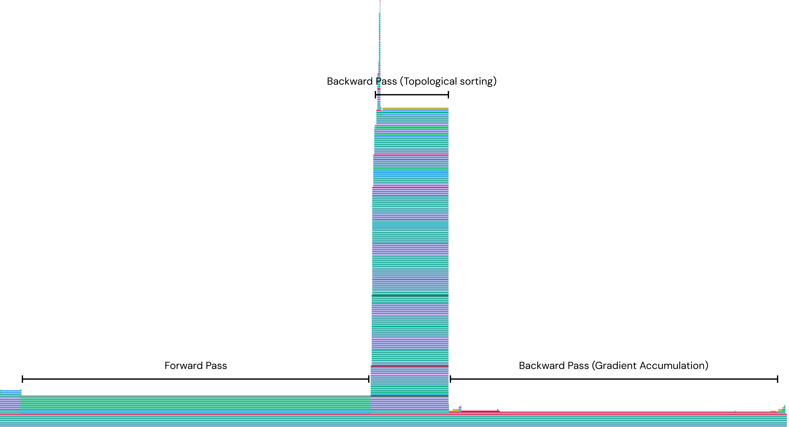
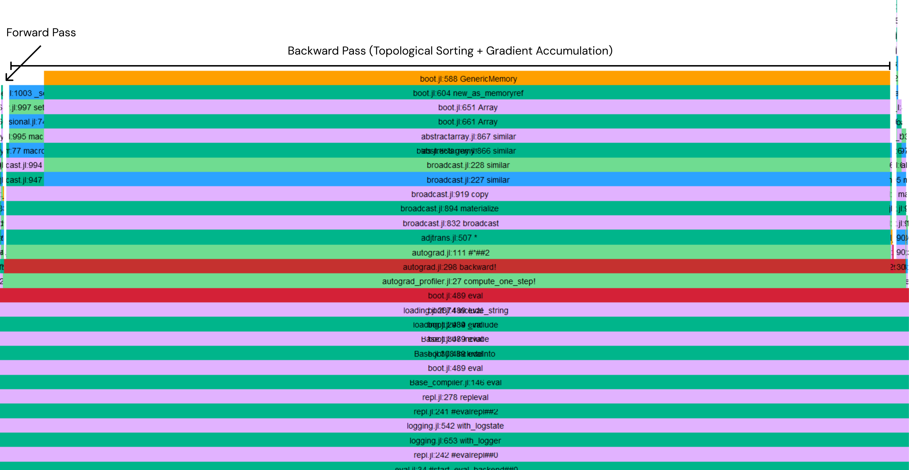

### Autograd Profiler Results

Tests conducted on one run with a linear layer + bias + ReLU. Input dim = Output dim = 256.

#### 1. Scalar-based AD

| Metric | Value |
| ------ | ----- |
| Execution time | 2.84 s |
| Total allocations | 4.34 M |
| Allocated memory | 130.549 MiB |
| GC time | 1.25% |
| Total nodes | 197633 |

Oberservations
- Forward and backward pass have a similar share of the total runtime
- A noticable fraction of execution time is spend traversing the computation graph in the `build_topo` function
- The forward pass contains many scalar operations, that are each reposinble for a new `Value` node
- The large number of scalar nodes motivates the transition to an array-based AD representation

#### 2. Array-based AD

| Metric | Value |
| ------ | ----- |
| Execution time | 0.0007 s |
| Total allocations | 195 |
| Allocated memory | 547.553 KiB |
| GC time | ~ 0% |
| Total nodes | 7 |

Oberservations
- Forward takes up a significantly smaller portion of the total runtime than backward
- Massive performance gains in execution time and total node count